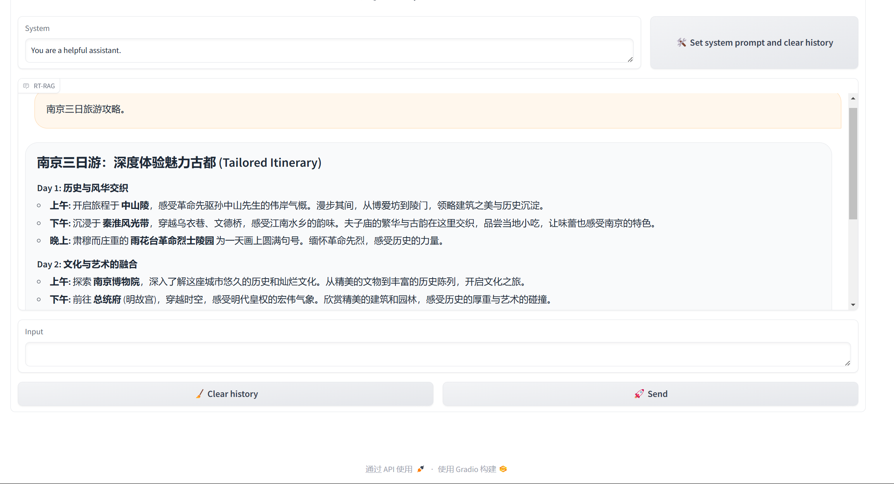
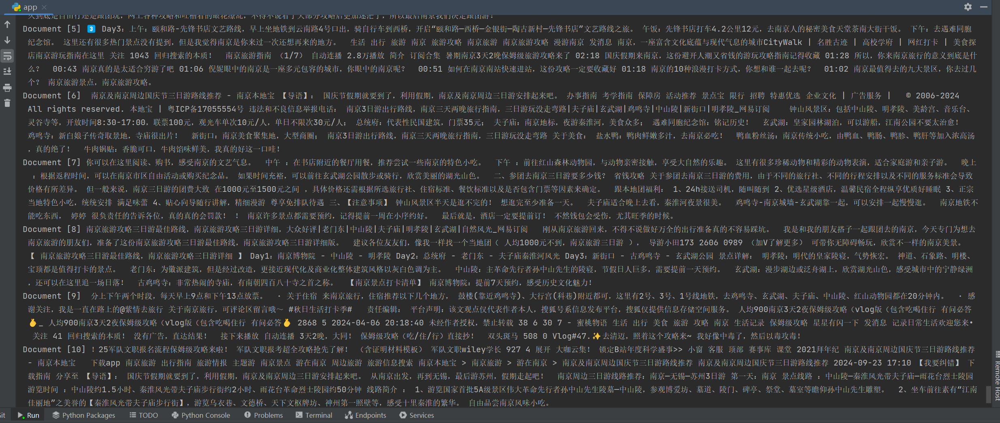

# A real-time retrieval-augmented generation method and device based on industrial brain

Real-Time Retrieval-Augmented Generation (RTRAG). First, the original query is reconstructed to get a new query that is easier for search engines to retrieve relevant content. Then, the retrieved content is preliminarily screened to remove nonsense or irrelevant text, and the cleaned text is segmented into sentences to get relevant documents. Then, the relevant documents are sorted and filtered using the TF-IDF algorithm, and the context acquisition strategy based on a greedy algorithm is used to finally obtain an extended document that is more relevant to the original query. Based on this, a decision-making and execution large language model (agent) is built specifically to generate pseudo-answers, which are then concatenated with the original query and the extended document to calculate semantic similarity. This achieves document reordering. Finally, the Top-K highest-similarity text is selected as the extended query, combined with the original query, as the input to the large language model to generate high-quality final answers.

## Install requirements

```setup
conda create --name rtrag python=3.10
conda activate rtrag
pip install -r requirements.txt
```

## Use Gradio to start
Before we start, we need to set up some variables, such as the cookies needed by the crawler, the backbone large language model, and the embedding model.
```run
python app.py
```





